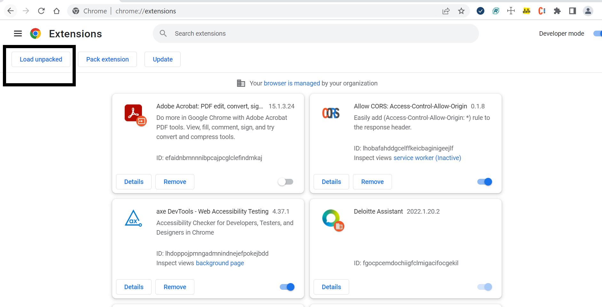

# Steps to add CodeEye Extension
Navigate to manage extensions in browser  

Switch on developer Mode  

Select load unpacked option  

Browse and select codeEyeExtension folder in repo  

# Steps to enable CodeEyeExtension in GitHub 
Navigate to Github page
Select codeEyeExtension

Open any PR and add comment by typing "#" you will see auto suggestions list based on searchkeyword

After You click on Add comment you can see the comment reflecting as below.

